### 光流
>基于光流warp的temporal loss增加视频分割的连续性

#### 1. [光流介绍](https://blog.csdn.net/qq_38906523/article/details/80781242)

概念：它是空间运动物体在观察成像平面上的像素运动的瞬时速度，是利用图像序列中像素在时间域上的变化以及相邻帧之间的相关性来找到上一帧跟当前帧之间存在的对应关系，从而计算出相邻帧之间物体的运动信息的一种方法。

| <div align=center>forward_(t-1)-t | <div align=center>image | <div align=center>backward_t-(t-1) |
|-------|:---|-------:|
| |<div align=center>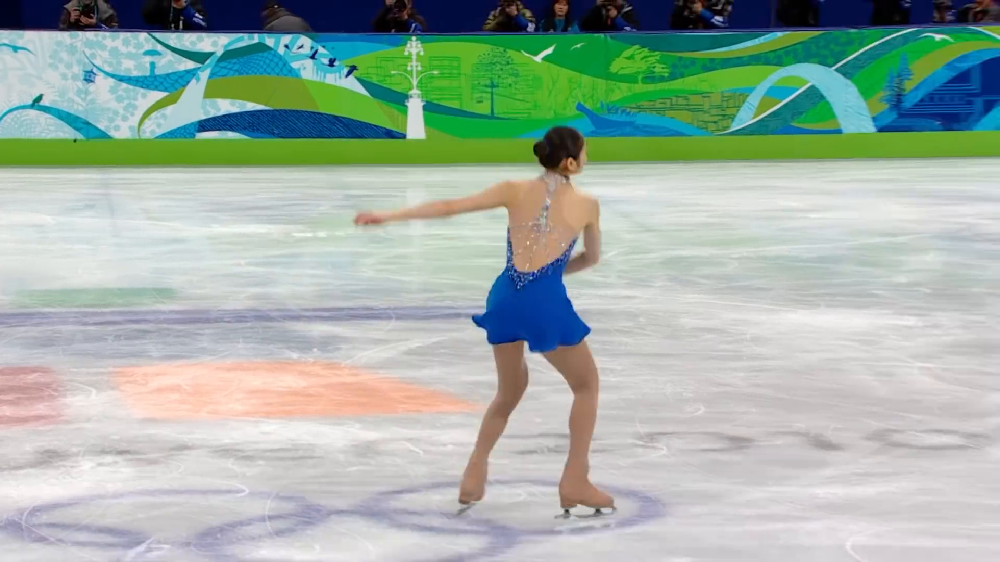0000.png|<div align=center> backward_1_0.png|
|<div align=center>forward_0_1.png|<div align=center>0001.png|<div align=center> backward_2_1.png|
|<div align=center>forward_1_2.png|<div align=center>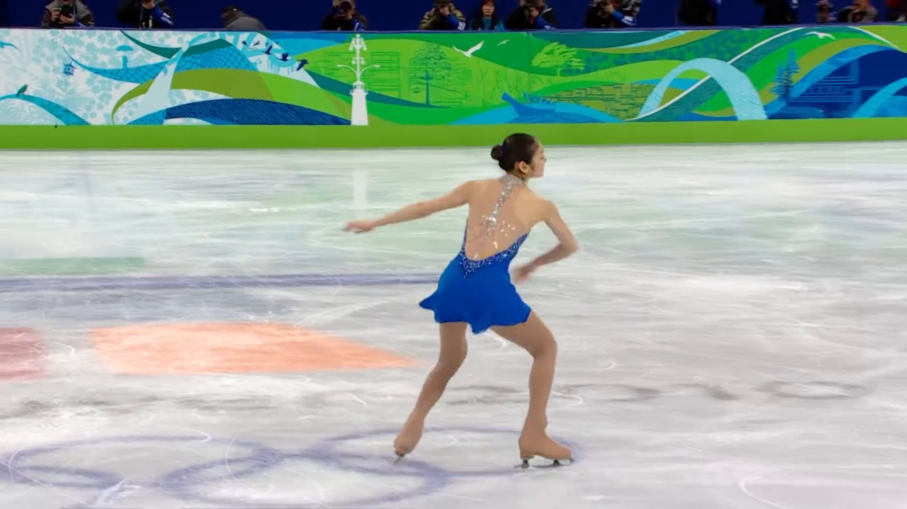0002.png| |    


* 计算条件：
    1. 亮度恒定，就是同一点随着时间的变化，其亮度不会发生改变。这是基本光流法的假定（所有光流法变种都必须满足），用于得到光流法基本方程；

    2. 小运动，这个也必须满足，就是时间的变化不会引起位置的剧烈变化，这样灰度才能对位置求偏导（换句话说，小运动情况下我们才能用前后帧之间单位位置变化引起的灰度变化去近似灰度对位置的偏导数），这也是光流法不可或缺的假定；

    3. 空间一致，一个场景上邻近的点投影到图像上也是邻近点，且邻近点速度一致。这是Lucas-Kanade光流法特有的假定，因为光流法基本方程约束只有一个，而要求x，y方向的速度，有两个未知变量。我们假定特征点邻域内做相似运动，就可以连立n多个方程求取x，y方向的速度（n为特征点邻域总点数，包括该特征点）。 

+ 计算：包含传统与深度学习的方法

    深度学习方法包含: [Flownet](https://blog.csdn.net/sigai_csdn/article/details/80664481)
                    [Flownet2.0](http://www.cnblogs.com/jiujing23333/p/9386695.html)
                    [Liteflownet](https://github.com/twhui/LiteFlowNet)
                    [PWCnet](https://github.com/RanhaoKang/PWC-Net_pytorch)
    
    [传统方法](https://github.com/SpONA/temporal-loss-with-optical-flow/tree/master/get_flow) 使用语句

        cd get_flow
        ./makeOptFlow.sh /flow/path/%05d.png /save/path/ 0 1
        或者  `python bash.py`
        

    对比：

    |  方法 |时 间| 准确度 |
    | ----- |:-----:| ---:|
    |传统方法| 30s    | 高 |
    |深度方法| <100ms |低  | 

+ 后处理:
    计算结果为.flo文件，文件储存较大，可以用gzip和pickle进行[压缩](https://github.com/SpONA/temporal-loss-with-optical-flow/blob/master/utils/savepickle.py)
    [读光流](https://github.com/SpONA/temporal-loss-with-optical-flow/blob/master/utils/readflow.py)
    [光流可视化](https://github.com/SpONA/temporal-loss-with-optical-flow/blob/master/utils/visflow.py)


#### 2. warp函数
[numpy](https://github.com/SpONA/temporal-loss-with-optical-flow/blob/master/utils/warp_numpy.py)

[pytorch-cpu](https://github.com/SpONA/temporal-loss-with-optical-flow/blob/master/utils/warp_torch_cpu.py)

[pytorch-cuda](https://github.com/SpONA/temporal-loss-with-optical-flow/blob/master/utils/warp_torch_cuda.py)

核心思想：
    光流存储的是两张图之间的位移大小，利用`grid_new = grid_old + flow`计算原图中某个像素对应到新图中的坐标位置

输入： `flow1, flow2, prev`

+ flow1表示 prev到cur的正向光流 shape = (H, W, 2)

+ flow2表示 cur到prev的反向光流 shape = (H, W, 2) 

+ prev表示前一帧图片 shape = (H, W, 3) (3表示RGB三个channel, 其实这里channel数为任意n可以，warp函数中对每一个channel都做warp, 输出的结果shape与输入一致)

函数`warp(flow1, flow2, prev)`的输出即为`warp_cur `

也可以反过来做，即`warp(flow2, flow1, cur)`的输出是`warp_prev`


#### 3. 光流的数据增强
[代码](https://github.com/SpONA/temporal-loss-with-optical-flow/blob/master/video_seg_flow/dataloader/video_generator.py#L95)

- **resize**:
    
    先利用线性插值将flow resize到新的shape

    `flow_resize = cv2.resize(flow, None, fx=fx, fy=fy, interpolation=cv2.INTER_LINEAR)`

    再对光流的xy方向数值分别乘以resize比例 fx和fy
    `flow[:,:,0] *= fx, flow[:,:,1] *= fy`
    (这里踩过的坑是数据类型，flow的dtype要转为float，下边的几种变换也需要)

- **horizontal flip**:
    
    利用从`cv2.clip(flow, 1)`对光流进行水平翻转, clip函数第二个参数为0是垂直翻转

    翻转过后位移的方向也改变了，对光流的x方向的数值乘以-1，`flow[:,:,0] *= -1` 

- **rotate**:
    
    首先定义一个旋转量`Rotate = cv2.getRotationMatrix2D((w/2,h/2), beta, 1)`  (w/2,h/2)是旋转中心; beta为旋转角度(逆时针); 1为resize rate, 前面已经resize过了，这里设为1，即不resize; 

    然后对光流进行旋转，利用函数`flow = cv2.warpAffine(flow, Rotate, new_shape)` (newshape为`(w,h)`与原图的`(h,w)`相反))

    旋转过后，光流的xy方向数值也要变换, 利用矩阵乘法进行坐标变换[参考第三小节](https://blog.csdn.net/csxiaoshui/article/details/65446125), 注意我们不是绕原点`(0,0)`而是图片的中心进行旋转的，所以要用先平移到原点，旋转后再移到原位置
    ```
    flow = flow.reshape(-1,2)  # flow shape = (n,2)
    rot0 = torch.ones(flow.shape[:1]).unsqueeze(1)
    flow = torch.cat((flow, rot0),dim=1)  #flow shape = (n,3) 即((n,x),(n,y),(n,0))
    rotm = torch.tensor([[cos,-sin,(1-cos)*w/2+h/2*sin],[sin, cos,(1-cos)*h/2-w/2*sin],[0,0,1]])
    flow = flow.float().mm(rotm).reshape(h,w,3)[:,:,:2]
    ```

- **random crop**:
    ```
    crop_size = 512
    crop_shape = prev.shape[:2] #3,H,W
    crop_h = random.randint(0,crop_shape[0]-crop_size)
    crop_w = random.randint(0,crop_shape[1]-crop_size)

    prev  = prev[crop_h:crop_h+crop_size, crop_w:crop_w+crop_size, :]
    cur   = cur[crop_h:crop_h+crop_size, crop_w:crop_w+crop_size, :]
    flow1 = flow1[crop_h:crop_h+crop_size, crop_w:crop_w+crop_size, :]
    flow2 = flow2[crop_h:crop_h+crop_size, crop_w:crop_w+crop_size, :]
    ```

| |<div align=center>prev | <div align=center>warp_prev | <div align=center>warp_cur |<div align=center>cur |
|---|:----:|:---:|:---:|-------:|
|<div align=center>origin|<div align=center>|<div align=center> |<div align=center> 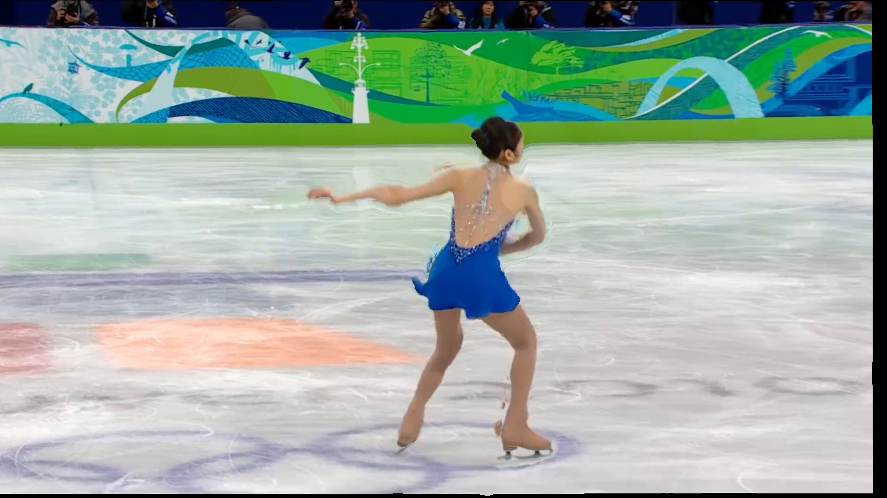|<div align=center> |
|<div align=center>flip|<div align=center>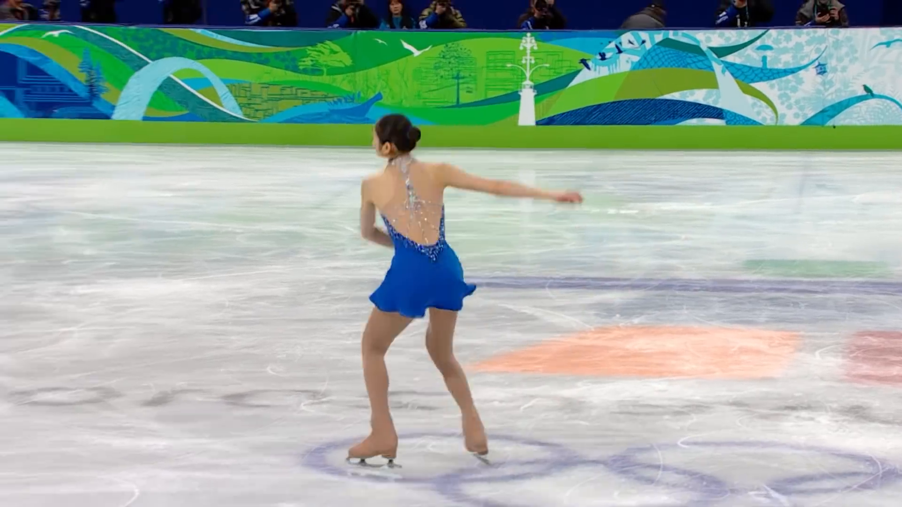|<div align=center> 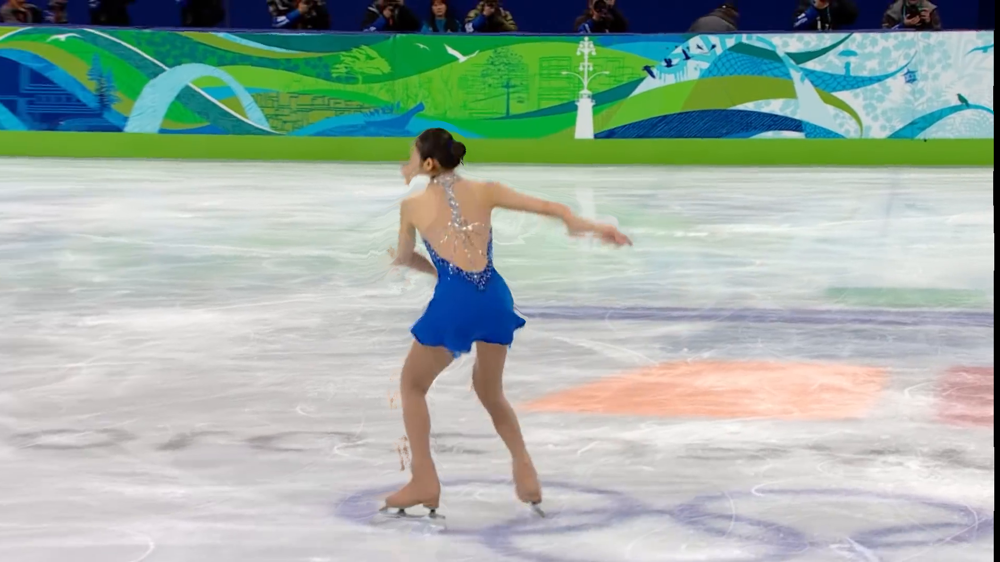|<div align=center> 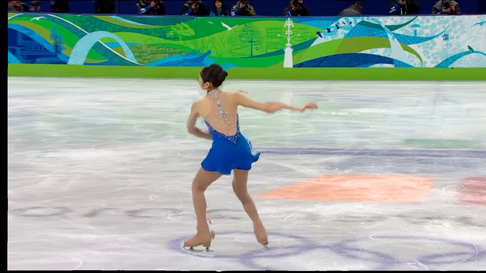|<div align=center> 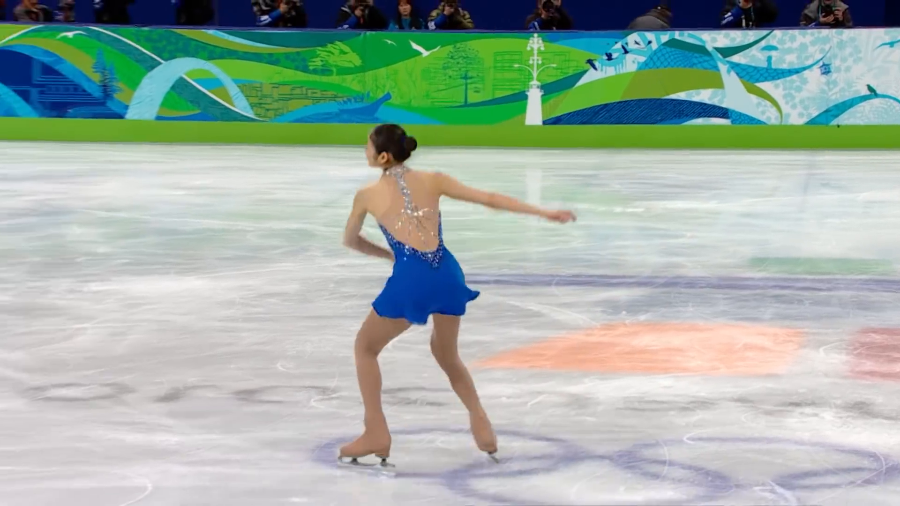|
|<div align=center>resize|<div align=center>|<div align=center> 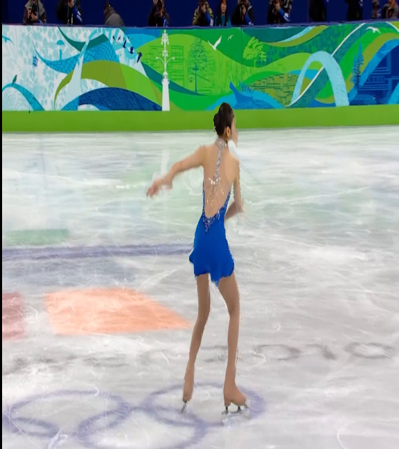|<div align=center> 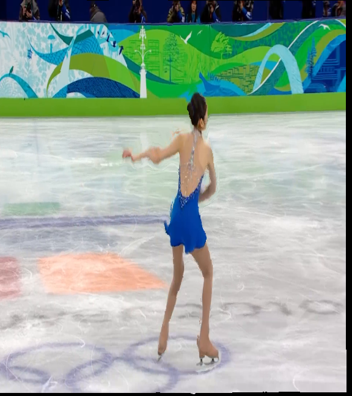|<div align=center> 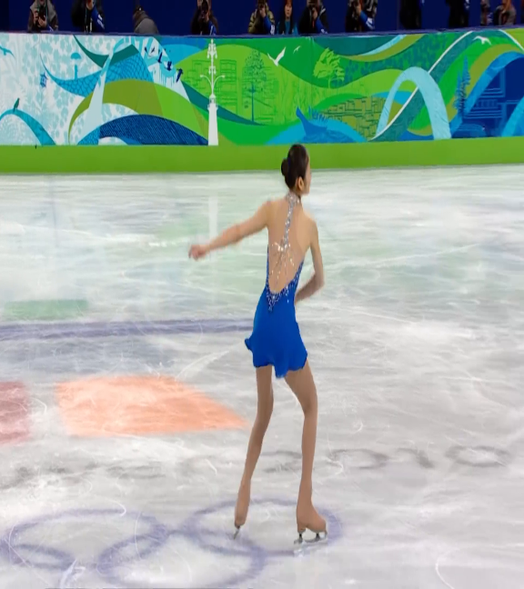|
|<div align=center>rotate|<div align=center>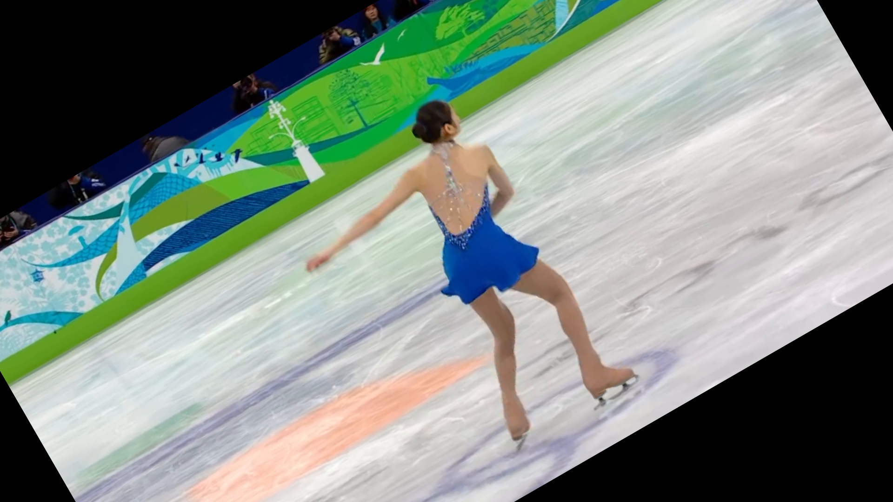|<div align=center> |<div align=center> 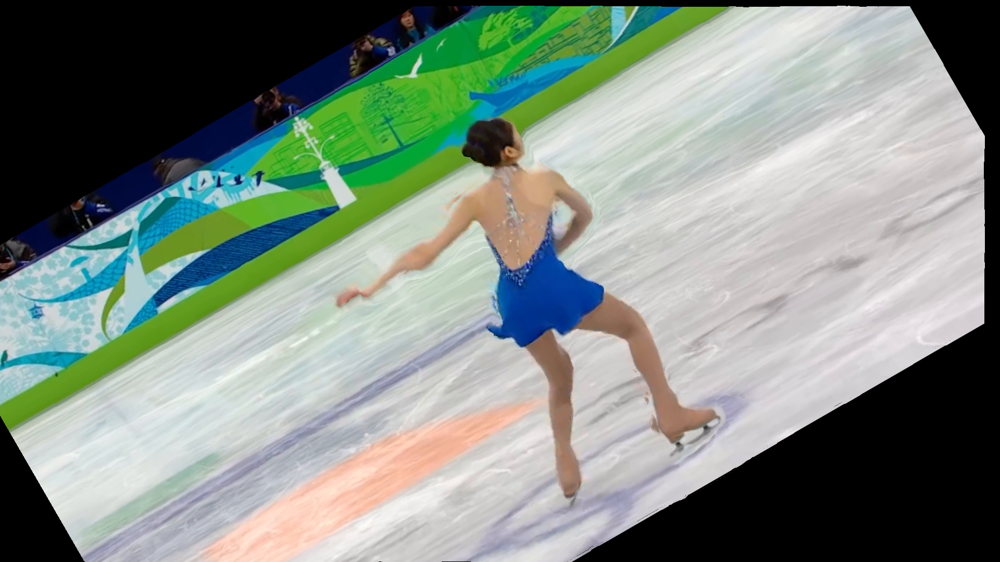|<div align=center> |
|<div align=center>crop|<div align=center>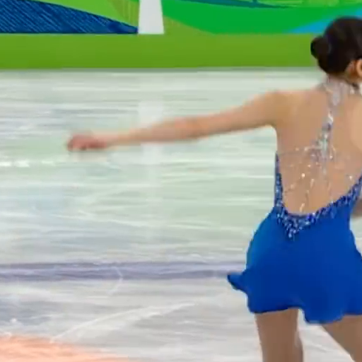|<div align=center> 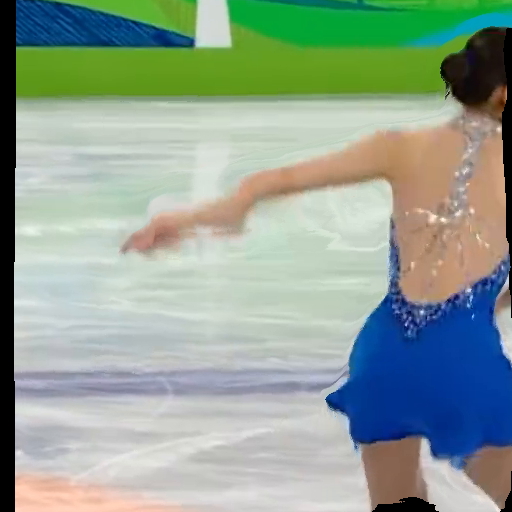|<div align=center> 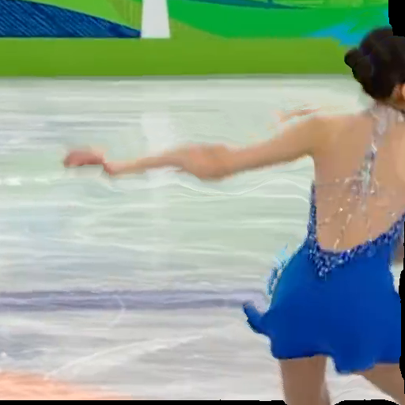|<div align=center> 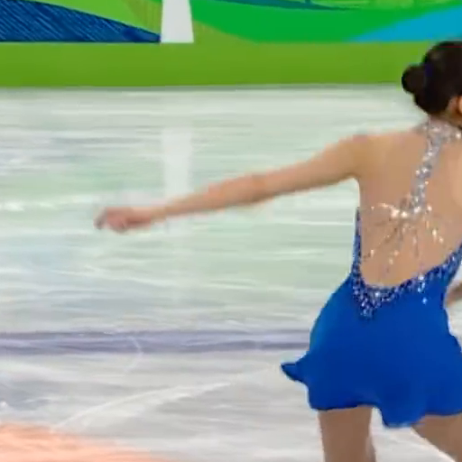|
|<div align=center>label|<div align=center>|<div align=center> |<div align=center> |<div align=center> |
|<div align=center>label_flip|<div align=center>|<div align=center> |<div align=center> |<div align=center> |
|<div align=center>label_resize|<div align=center>|<div align=center> 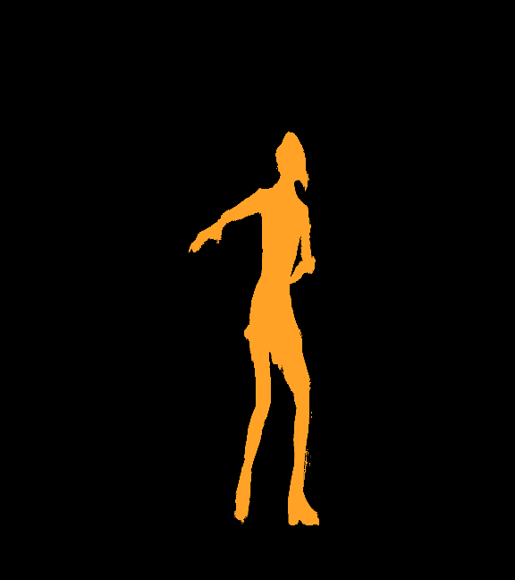|<div align=center> 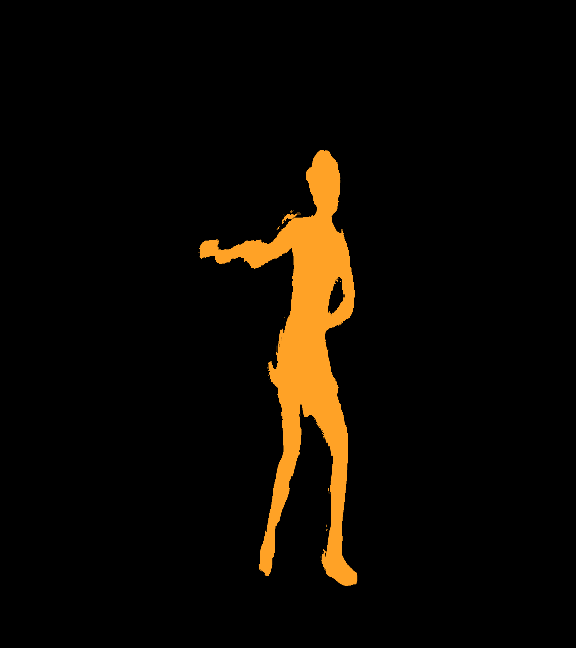|<div align=center> |
|<div align=center>label_rotate|<div align=center>|<div align=center> |<div align=center> |<div align=center> |
|<div align=center>label_crop|<div align=center>|<div align=center> 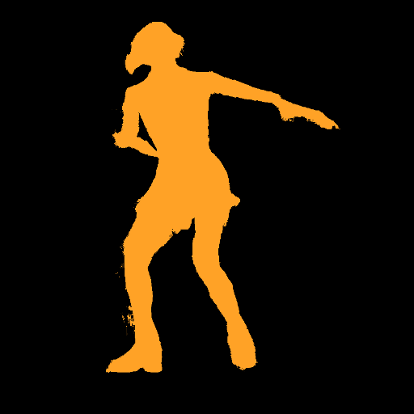|<div align=center> |<div align=center> |
